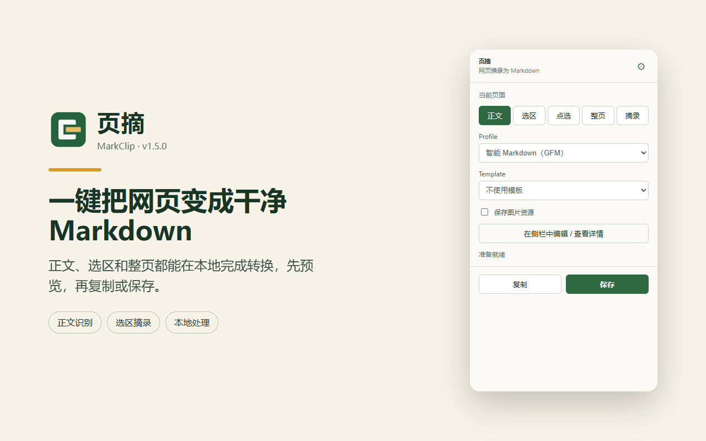
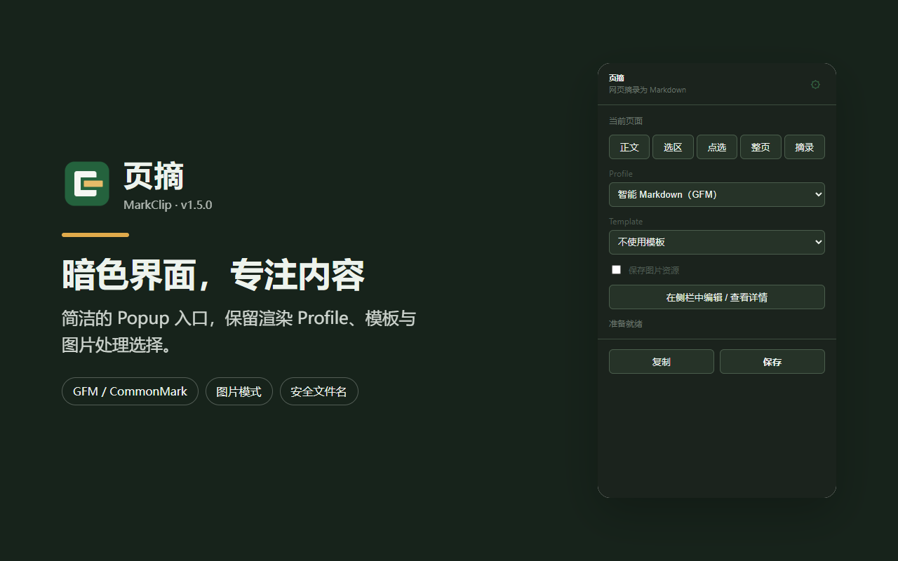
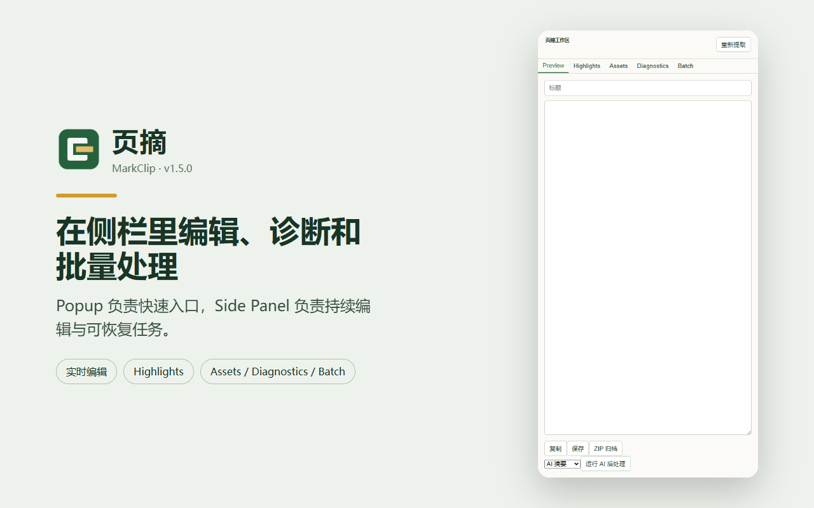

# 页摘 · Yezhai

> **把杂乱的网页，一键变成干净纯粹的 Markdown。**

[简体中文](README.md) | [English](README.en.md) · [下载最新 Release](https://github.com/rowanjove/MarkClip/releases/latest) · [问题反馈](https://github.com/rowanjove/MarkClip/issues)

页摘是一款专注于本地体验与知识归档的浏览器扩展（Chrome / Edge / Firefox）。专为 **Obsidian、Notion、Logseq** 等双链笔记与本地知识库用户打造，在浏览器本地完成正文净化、公式与代码高亮保留、图片打包及格式转换，不让网页杂质污染你的笔记。



<details>
<summary><b>查看深色模式与侧边栏截图</b></summary>

| 深色模式弹窗 | 侧边栏常驻工作台 (Side Panel) |
| :---: | :---: |
|  |  |

</details>

---

## 核心亮点

* 🧹 **智能正文提取**：自动剔除网页导航、广告横幅、侧边推荐及页脚杂音，精准保留文章标题、正文结构与层级标题。
* 📐 **复杂排版保真**：完美转换数学公式（LaTeX / MathJax / KaTeX）、代码高亮与语言标签、嵌套列表、表格、引用块及注脚。
* ✂️ **灵活摘录模式**：
  * **智能全文**：一键提取整篇主要内容；
  * **局部选区**：框选网页任意区块快速剪藏；
  * **多段高亮拼接**：边读边划重点，自动合并生成阅读随笔。
* 🖼️ **图片与资源包管理**：
  * **远程链接**：保留原图 URL，保持文本轻盈；
  * **独立资料包 (ZIP)**：一键将 Markdown 和所有引用的高清图片打包下载，防图片防盗链失效；
  * **Base64 内嵌**：生成单文件自包含 Markdown。
* 🪨 **无缝直达 Obsidian**：支持通过 Obsidian URI 一键将摘录内容存入指定的本地笔记库。
* 🔒 **100% 离线与隐私优先**：无需注册任何账号，解析与格式转换全部在本机浏览器沙箱内完成，绝不上传页面内容。

---

## 快速安装

1. 从 [Releases 页面](https://github.com/rowanjove/MarkClip/releases/latest) 下载最新的安装包：
   * Chrome / Edge: `markclip-x.x.x-chrome.zip`
   * Firefox: `markclip-x.x.x-firefox.zip`
2. 解压下载的 ZIP 文件到固定本地文件夹。
3. 打开浏览器扩展管理页面（Chrome 地址栏输入 `chrome://extensions/`），开启右上角 **“开发者模式”**。
4. 点击 **“加载已解压的扩展程序”**，选择刚刚解压的目录即可开始使用。

> 💡 **升级提示**：升级新版本时，直接覆盖解压目录并在扩展页点击“重新加载”即可，无需卸载扩展，以保留你个性化的提取偏好与快捷键配置。

---

## 日常使用技巧

* **快捷弹窗**：点击浏览器工具栏图标，或使用快捷键呼出，实时预览转换效果。
* **侧边栏常驻 (Side Panel)**：在 Chrome / Edge 中开启侧边栏，适合多标签页集中查阅资料时边读边摘。
* **网页内浮动工具**：选中文本即可浮现剪藏快捷按钮，碎片化记录更顺手。

---

## 本地开发与测试

```bash
# 安装依赖
npm ci

# 启动开发热重载模式
npm run dev

# 运行质量门禁与端到端测试
npm run test:e2e:modern
npm run release:verify
```

更多技术实现细节与扩展说明，请参阅：
* [浏览器支持清单 (BROWSER_SUPPORT.md)](./BROWSER_SUPPORT.md)
* [导出目标与 Obsidian 适配 (EXPORT_TARGETS.md)](./EXPORT_TARGETS.md)
* [安全与权限设计 (SECURITY.md)](./SECURITY.md)

---

## 开源协议

本项目采用 [MIT License](LICENSE) 开源。
