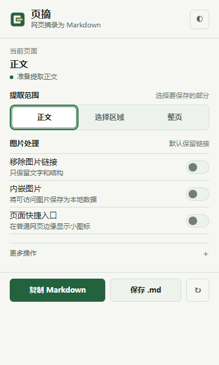
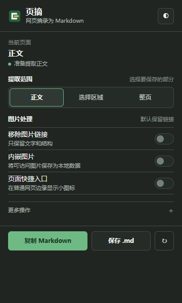
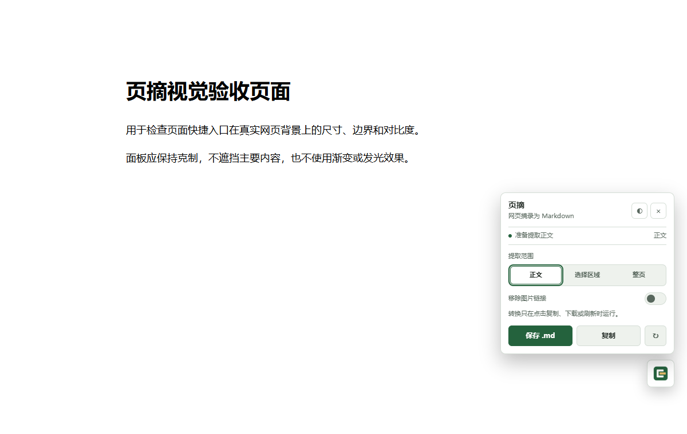
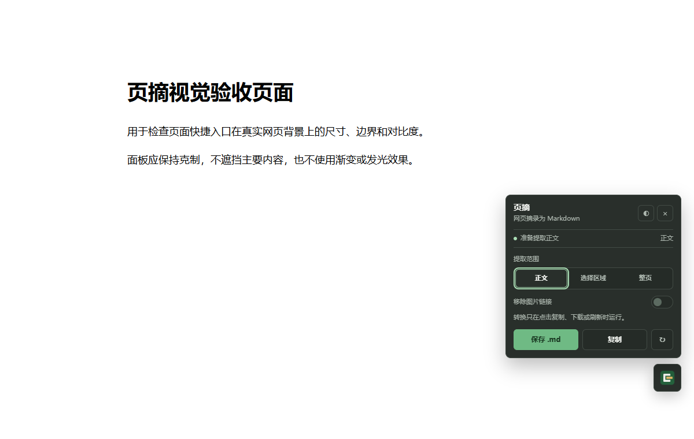

# 页摘 - 网页摘录为 Markdown


页摘是一个 Chrome MV3 扩展，用来把网页正文、选择区域或整页内容转换成干净的 Markdown，方便复制到笔记、知识库或 Markdown 文档。

对外产品名为「页摘」，GitHub 仓库保留 `rowanjove/MarkClip`。内部 `MarkClip*` 命名空间、`page2md:*` 设置键及 `markclip` 打包名称暂时保留，避免影响现有使用方式与设置。

> 以下截图与说明对应 `main` 分支的开发版本（2026-09-01），不代表历史 v1.3.0 Release 已更新。体验本次重构，请下载当前分支源码并按下方步骤加载。

## 界面预览

默认浅色，也可切换深色。主要操作直接展示，Obsidian 和批量导出收在“更多操作”内。

| 浅色界面 | 深色界面 |
| --- | --- |
|  |  |

页面快捷入口可拖动，点击展开提取范围、复制和保存操作。



<details>
<summary>查看深色浮窗</summary>



</details>

截图使用本地演示页面，不含用户数据；浮窗偏好及操作消息使用测试替身，图标通过真实扩展资源加载。截图用于人工视觉复核，不等同于完整导出链路验收。

当前发布目标为支持 Manifest V3 的 Chromium 浏览器（Chrome、Edge 等）。Firefox/Safari 需要单独验证浏览器 API 和动态 content script 权限模型后再发布。

浏览器支持范围和发布前 smoke 清单见：[BROWSER_SUPPORT.md](./BROWSER_SUPPORT.md)。

品牌、界面和无障碍基线见：[DESIGN_GUIDE.md](./DESIGN_GUIDE.md)。

商店名称、截图和图标素材见：[STORE_LISTING.md](./STORE_LISTING.md)。

本轮截图和交互/无障碍验收记录见：[VISUAL_REVIEW.md](./VISUAL_REVIEW.md)。

它面向中文用户设计，适合把网页资料整理到 Obsidian、Notion 和其他 Markdown 工具。

## 主要功能

- 提取网页正文，优先使用 Mozilla Readability。
- 支持选择一个或多个页面区域，只导出你需要的内容。
- 支持全页转换，适合网页归档。
- 复制 Markdown 到剪贴板。
- 下载 `.md` 文件。
- 可选打开 Obsidian URI，把当前内容写入默认 vault。
- 可选批量导出当前窗口中的多个网页标签页。
- 可在弹窗预览区直接编辑 Markdown 和文件标题后再复制或下载。
- 可选移除图片链接，减少文档体积。
- 可选将可访问图片内嵌为 data URL；失败时保留原链接。
- 自动添加 `title`、`source`、`date` frontmatter，方便溯源。
- 在普通网页显示可拖动悬浮面板，减少重复点击扩展按钮。
- 支持深色 / 浅色界面。

## 隐私说明

页摘在浏览器本地完成网页提取和 Markdown 转换。

页摘不上传网页内容，不收集浏览记录，不使用远程服务器处理页面数据，也不接入统计分析服务。

完整隐私政策见：[PRIVACY.md](./PRIVACY.md)。

高级用户可以参考：[SITE_RULES.md](./SITE_RULES.md) 配置站点级 selector 和 Markdown 模板。
导出目标和本地优先限制见：[EXPORT_TARGETS.md](./EXPORT_TARGETS.md)。

## 本地安装

1. 打开 Chrome 的 `chrome://extensions`。
2. 开启右上角“开发者模式”。
3. 点击“加载已解压的扩展程序”。
4. 选择本项目文件夹。

首次安装默认不会向所有网页注入脚本。打开扩展弹窗即可按需转换当前页面；如果开启“页面悬浮按钮”，扩展会单独请求可选的网页访问权限，关闭该功能后可以撤销动态注册。

## 开发与测试

运行检查和测试：

```bash
npm install
npm run check
```

`npm test` 包含纯函数、JSDOM 转换集成和 manifest 回归测试。浏览器 E2E 使用本地 fixture，避免依赖公网。

更新图标、商店素材和截图：

```bash
npm run icons:generate
npm run store-assets:generate
npm run ui-review:capture
```

截图脚本需要已安装 Playwright Chromium，并会启动浏览器。安全检查与本地打包分别使用 `npm run check:security`、`npm run package`；打包产物在 `dist/`，不提交至源码仓库。

## English

Yezhai · Web to Markdown (页摘) is a Chrome MV3 extension that converts the current web page, selected page regions, or full page content into clean Markdown locally in the browser.

It does not collect user data or upload page content to any server.
